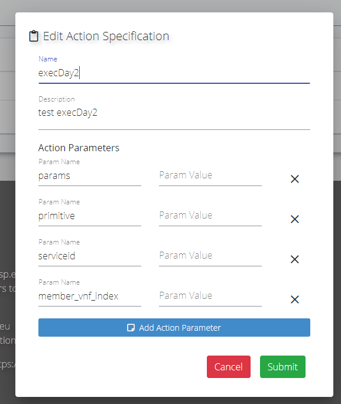
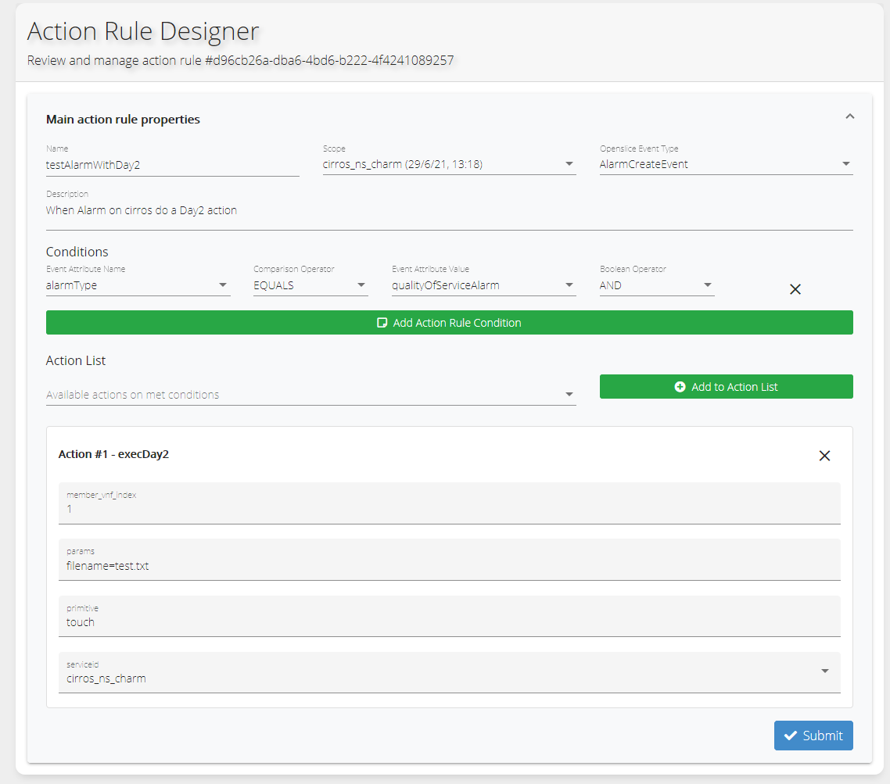

# Alarms

In Openslice parts of TMF642 Alarm Management API are currently implemented. Alarms can be managed through the TMF API endpoint as well as the UI.


## Alarms and Actions

Note: Actions is an experimental feature. We expect to have a more mature solution in future. The component in the architecture is the Openslcie Assurance Services

Alarms can be automatically resolved by specific actions. Today only the following actions are offered.

* execDay2
* scaleServiceEqually


## execDay2

Usually used to perform a Day2 configuration (towards OSM). To use it, Create a New Action Specification Name=execDay2 as following

[](./images/alarms_actions/day2actionspec.png)


Now make a Service Order for your service. In this example ςε used a cirros NSD

Create a  New Action Rule for the running services as the following example:


[](./images/alarms_actions/action_rule_exampleday2.png)

The scope is the running cirros service. 

Params should be paramname=value;paramname2=value2;paramname3=value3 (must exist in the VNF otherwise OSM will raise an error).

In this case should be filename=test.txt

Primitive=touch

ServiceId = select the service which will accept the Day2. In this case is the same

To test it:

Go to the Service Inventory and select the active Service.

Note the UUID of the service (e.g. c4e7990a-e174-4cd2-9133-b10e56721e08 copy from address bar),  DeploymentRequestID and NSDID from characteristics
 
You can either use the UUID of the service or the DeploymentRequestID  and POST to the Alarms endpoint ( /tmf-api/alarmManagement/v4/alarm)
 
 
If the DeploymentRequestID  is used then POST:

```

{
  "alarmRaisedTime": "2021-06-29T12:30:24.675Z",
  "alarmReportingTime": "2021-06-29T12:30:54.675Z",
  "state": "raised",
  "alarmType": "qualityOfServiceAlarm",
  "probableCause": "thresholdCrossed",
  "ackState": "unacknowledged",
  "perceivedSeverity": "major",
  "sourceSystemId": "mano-client-service",
  "alarmDetails": "NSID=3;DeploymentRequestID=1",
  "specificProblem": "myalram raised"
}

```


If the UUID is used then POST:

```

{
  "alarmRaisedTime": "2021-06-29T12:30:24.675Z",
  "alarmReportingTime": "2021-06-29T12:30:54.675Z",
  "state": "raised",
  "alarmType": "qualityOfServiceAlarm",
  "probableCause": "thresholdCrossed",
  "ackState": "unacknowledged",
  "perceivedSeverity": "major",
  "sourceSystemId": "mano-client-service",
  "alarmDetails": "analarm",
  "specificProblem": "myalram raised",
  "affectedService": [
    {
      "id": "c4e7990a-e174-4cd2-9133-b10e56721e08"
    }
  ]
  
}

```

The Alarm to be created must have the affected Service ID equal to the running service from the scope (the cirros_ns)

Go to service inventory you will see the notes and also the service characteristics for any  EXEC_ACTION updates

You can also adjust the alarm conditions. They must match true so the alarm to be acknowledged
So if another external service raises an Alarm (with POST) for the running service, a Day2 will be performed on another Service


## scaleServiceEqually


This action is used from getting a scaling event from OSM. Please see the next demo for details on how it works


### Prototype demo

You can watch how we used the prototype on the following ETSI ZMS PoC #2

* ETSI ZMS PoC #2: <https://www.etsi.org/events/1905-webinar-zsm-poc-2-showcase-automated-network-slice-scaling-in-multi-site-environments/>
