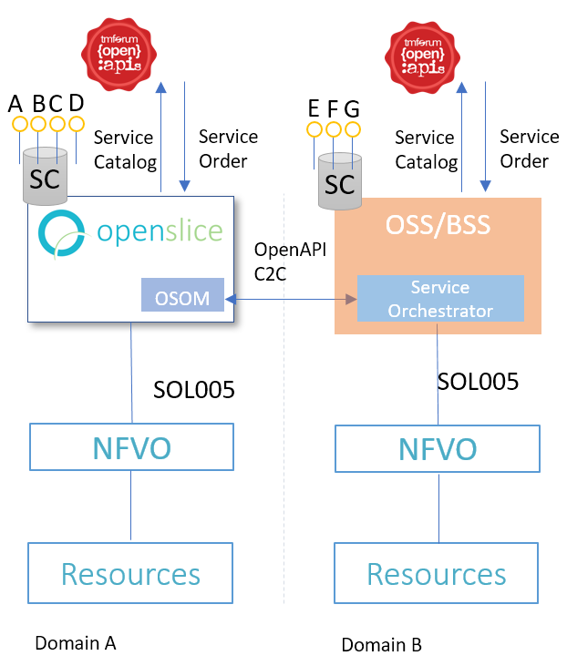

# Consuming Services From External Partner Organizations

A typical deployment across domains, involves today some typical components: i) an OSS/BSS to allow customers access the service catalog and perform service orders, ii) a Service Orchestrator (SO) component for executing the service order workflow, as well as iii) a Network Functions Virtualization Orchestrator (NFVO) for configuring the iv) network resources.

TMF Open APIs are introduced not only for exposing catalogues and accepting service orders, but also implementing the East-West interfaces between the domains, fulfilling also the LSO requirements as introduced by MEF.

The following figure shows how openslice could be used in such scenarios:

[](../images/multi-domain-architecture.png)


In Openslice we can consume services from 3rd parties via Open APIs.

We use the TMF 632 Party Management model to specify Organizations that we can exchange items and other information such as:

- Import Service Specifications
- Create a Service Order
- Use the Service Inventory to query the status of the service ordered to the external partner organization

## Define an Organization as 3rd party to consume services East-West 

An organization must have the following characteristics in openslice catalog, like for example:

"EXTERNAL_TMFAPI_BASEURL", "http://portal.openslice.io"

"EXTERNAL_TMFAPI_CLIENTREGISTRATIONID", "authOpensliceProvider"

"EXTERNAL_TMFAPI_OAUTH2CLIENTID", "osapiWebClientId"

"EXTERNAL_TMFAPI_OAUTH2CLIENTSECRET", "secret"

"EXTERNAL_TMFAPI_OAUTH2SCOPES", scopes

"EXTERNAL_TMFAPI_OAUTH2TOKENURI", "http://portal.openslice.io/osapi-oauth-server/oauth/token"

"EXTERNAL_TMFAPI_USERNAME", "admin"

"EXTERNAL_TMFAPI_PASSWORD", "openslice"

"EXTERNAL_TMFAPI_SERVICE_CATALOG_URLS" = "/test/v1/servicecatalog?lifeCycleStatus=Published" (this is optional)

"EXTERNAL_TMFAPI_SERVICE_ORDER_URLS"= "/test/v1/serviceorder" (this is optional)
		
		
An example Organization defined example in json:
```

{
  "uuid": "1a09a8b5-6bd5-444b-b0b9-a73c69eb42ae",
  "@baseType": "BaseEntity",
  "@schemaLocation": null,
  "@type": null,
  "href": null,
  "name": "Openslice.io",
  "id": "1a09a8b5-6bd5-444b-b0b9-a73c69eb42ae",
  "isHeadOffice": null,
  "isLegalEntity": null,
  "nameType": null,
  "organizationType": null,
  "tradingName": null,
  "contactMedium": [],
  "creditRating": [],
  "existsDuring": null,
  "externalReference": [],
  "organizationChildRelationship": [],
  "organizationIdentification": [],
  "organizationParentRelationship": null,
  "otherName": [],
  "partyCharacteristic": [
    {
      "uuid": "3a2f7221-e0a2-4a6b-88d1-534c8e1963f6",
      "@baseType": "BaseEntity",
      "@schemaLocation": null,
      "@type": null,
      "href": null,
      "name": "EXTERNAL_TMFAPI_CLIENTREGISTRATIONID",
      "valueType": null,
      "value": {
        "value": "authOpensliceProvider",
        "alias": null
      }
    },
    {
      "uuid": "c24bb527-f178-4d38-9b93-2027c1732876",
      "@baseType": "BaseEntity",
      "@schemaLocation": null,
      "@type": null,
      "href": null,
      "name": "EXTERNAL_TMFAPI_USERNAME",
      "valueType": null,
      "value": {
        "value": "admin",
        "alias": null
      }
    },
    {
      "uuid": "27e45df8-414b-44c6-a5d5-3f064e2cfd3b",
      "@baseType": "BaseEntity",
      "@schemaLocation": null,
      "@type": null,
      "href": null,
      "name": "EXTERNAL_TMFAPI_PASSWORD",
      "valueType": null,
      "value": {
        "value": "openslice",
        "alias": null
      }
    },
    {
      "uuid": "e0e470b8-6024-4014-8a18-2333e5465ce1",
      "@baseType": "BaseEntity",
      "@schemaLocation": null,
      "@type": null,
      "href": null,
      "name": "EXTERNAL_TMFAPI_OAUTH2CLIENTSECRET",
      "valueType": null,
      "value": {
        "value": "secret",
        "alias": null
      }
    },
    {
      "uuid": "3e0de762-ac80-4c1e-a0a1-f265ff0899b4",
      "@baseType": "BaseEntity",
      "@schemaLocation": null,
      "@type": null,
      "href": null,
      "name": "EXTERNAL_TMFAPI_OAUTH2SCOPES",
      "valueType": null,
      "value": {
        "value": "admin;read",
        "alias": null
      }
    },
    {
      "uuid": "0bbb8314-f7f2-420d-9fed-ba054b15f886",
      "@baseType": "BaseEntity",
      "@schemaLocation": null,
      "@type": null,
      "href": null,
      "name": "EXTERNAL_TMFAPI_OAUTH2TOKENURI",
      "valueType": null,
      "value": {
        "value": "http://portal.openslice.io/osapi-oauth-server/oauth/token",
        "alias": null
      }
    },
    {
      "uuid": "3a567de4-79eb-4006-a500-3e5229b44175",
      "@baseType": "BaseEntity",
      "@schemaLocation": null,
      "@type": null,
      "href": null,
      "name": "EXTERNAL_TMFAPI_OAUTH2CLIENTID",
      "valueType": null,
      "value": {
        "value": "osapiWebClientId",
        "alias": null
      }
    },
    {
      "uuid": "6dca729f-dbe1-46b7-89f1-5c4f9fe89d4e",
      "@baseType": "BaseEntity",
      "@schemaLocation": null,
      "@type": null,
      "href": null,
      "name": "EXTERNAL_TMFAPI_BASEURL",
      "valueType": null,
      "value": {
        "value": "http://portal.openslice.io",
        "alias": null
      }
    }
  ],
  "relatedParty": [],
  "status": null,
  "taxExemptionCertificate": []
}

```
		