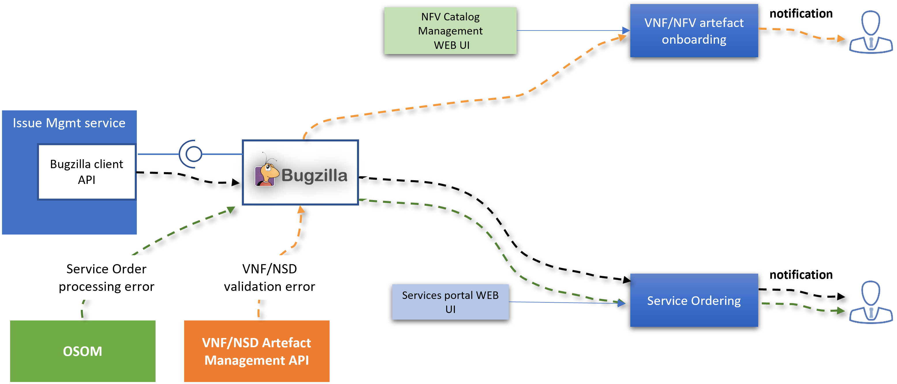

# Issue Management

For issue management support, Openslice relies on Bugzilla. Bugzilla is a ticketing tool that allows issue reporting and tracking via tickets to all relevant stakeholders. 

The figure below displays the overall issue management service architecture integrating Bugzilla as its core and how this tool interacts with other Openslice services presenting some distinctive scenarios. It should be noted that Bugzilla tickets will not only be used for bugs/errors, but also for general requests, e.g. Service Order procedure.

