# Openslice Service Orchestration and Order Management - OSOM

OSOM is a service responsible for:

* Service Order Management (SOM)
* Service Orchestration (SO)

It uses open source Flowable Business process engine (https://www.flowable.org) .

A Service Order follows the states as defined in TMF641 specification: 

[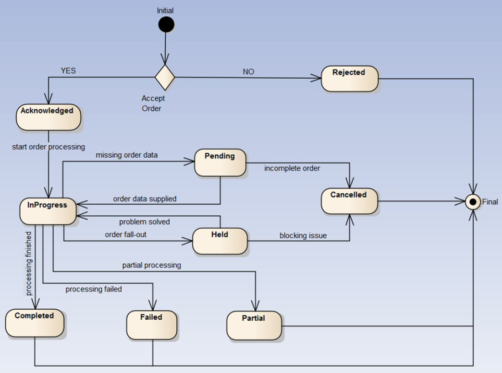](../images/service_order_states.png)

## Initial state

When a new order is created, it goes into the Initial state. It is stored in the repository and triggers an Event.

[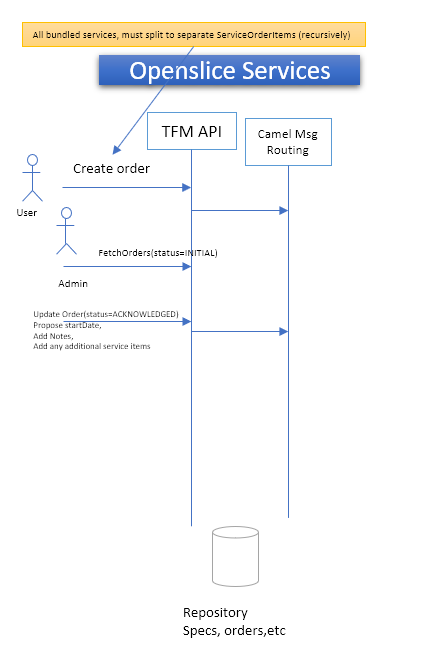](../images/service_order_initial_state.png)

Administrators are notified usually from the Ticketing System of a new order. They login to Openslice and change the State of the order either to ACKNOWLEDGED or REJECTED. If ACKNOWLEDGED they can Propose a startDate, add Notes, and add any additional service items

## Order scheduler

A process checks every 1 minute for ACKNOWLEDGED orders.

[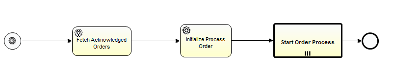](../images/order_scheduler_bpm.png)

[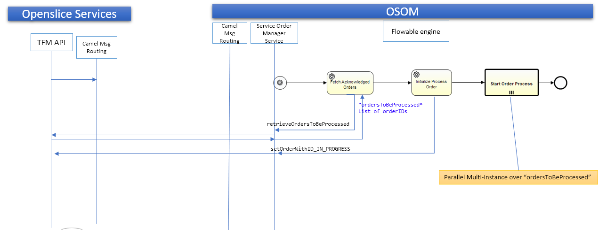](../images/order_scheduler_diagram.png)

It retrieves all orders that are in ACKNOWLEDGED state and if the start date is in time it will initialize the process by settingn the order in IN_PROGRESS state. Finally the Start Order Process will start.

## Start order process

This process for now is a draft simple prototype to make a simple orchestration via NFVO. Here the actual Services (TMF638/640 model) are created and attached to Service Order and Service Inventory.

[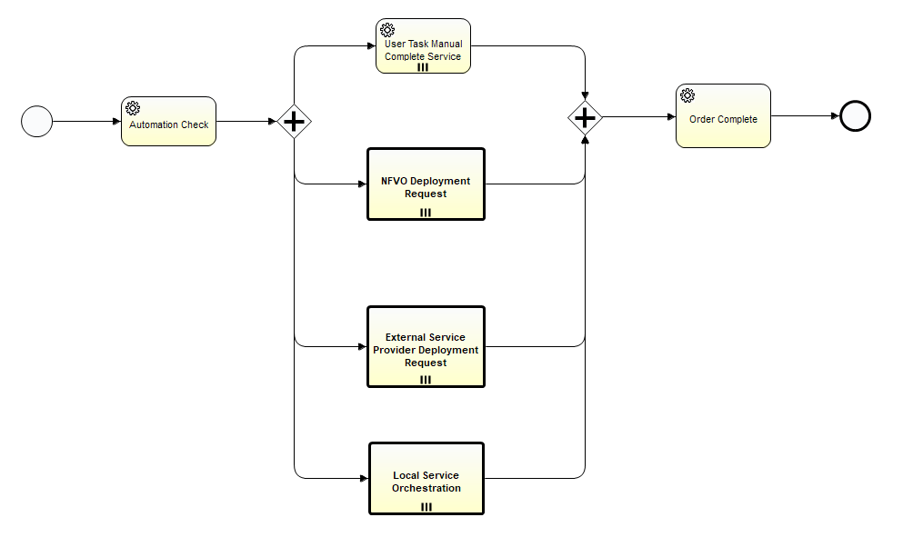](../images/start_order_process_bpm.png)

[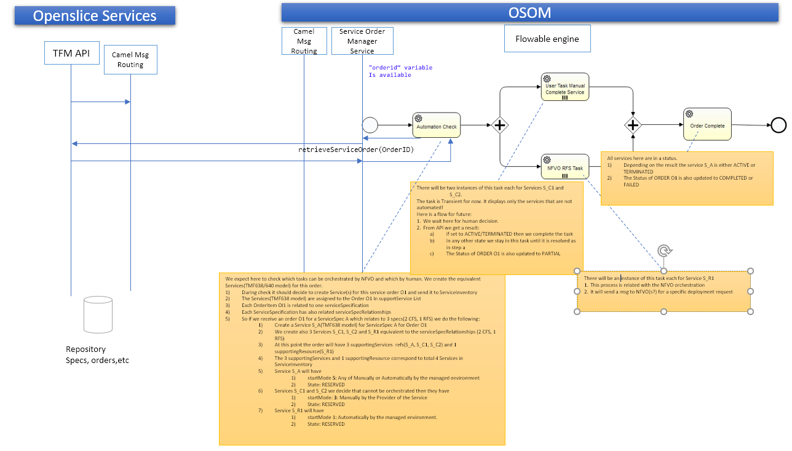](../images/start_order_process_diagram.png)

We expect here to check which tasks can be orchestrated by NFVO and which by human. We create the equivalent Services(TMF638/640 model) for this order.

1. During check it should decide to create Service(s) for this service order O1 and send it to ServiceInventory
2. The Services(TMF638 model) are assigned to the Order O1 In supportService List
3. Each OrderItem OI1 is related to one serviceSpecification
4. Each ServiceSpecification has also related serviceSpecRelationships
5. So if we receive an order O1 for a ServiceSpec A which relates to (a bundle of) 3 specs(2 CFS, 1 RFS) we do the following:
	1. Create a Service S_A(TMF638 model) for ServiceSpec A for Order O1
	2. We create also 3 Services S_C1, S_C2 and S_R1 equivalent to the serviceSpecRelationships (2 CFS, 1 RFS) 
	3. At this point the order will have 1 Local Service Orchestration Process(S_A),  2 supportingServices  refs(S_C1, S_C2) and 1 supportingResource(S_R1)
	4. The 3 supportingServices and 1 supportingResource correspond to total 4 Services in ServiceInventory
	5. Service S_A will have: 
		1. startMode 1: Automatically by the managed environment
		2. State: RESERVED and the Lifecycle will be handled by OSOM
	6. Services S_C1 and S_C2 we decide that cannot be orchestrated then they have 
		1. startMode: 3: Manually by the Provider of the Service
		2. State: RESERVED and the Lifecycle will be handled by OSOM
		3. If the CFS is a bundle spec it is further recursively orchestrated 
	7. Service S_R1 will have 
		1. startMode 1: Automatically by the managed environment.
		2. State: RESERVED
		3. IF The Service has the characteristic CharacteristicByName( "NSDID") it will be further processed by the NFVO 
   
   
There will be two instances of task "User Task Manual Complete Service" each for Services S_C1 and S_C2. The task is Transient for now. It displays only the services that are not automated! 
Here is a flow for future:

1. We wait here for human decision.
2. From API we get a result:
	a. If set to ACTIVE/TERMINATED then we complete the task
	b. In any other state we stay in this task until it is resolved as in step a
	c. The Status of ORDER O1 is also updated to PARTIAL

There will be an instance of  NFVODeploymentRequest process  each for Service S_R1. (see later)

1. This process is related with the NFVO orchestration
2. It will send a msg to NFVO(s?) for a specific deployment request

All services in "Order Complete" are in a status:

1. Depending on the result the service S_A is either ACTIVE or INACTIVE or TERMINATED
2. The Status of ORDER O1 is also updated to COMPLETED  or PARTIAL (in case we have some services running) or FAILED (in cases we have errors)

  
A Service follows the states as defined in TMF638 Service Inventory specification: 

[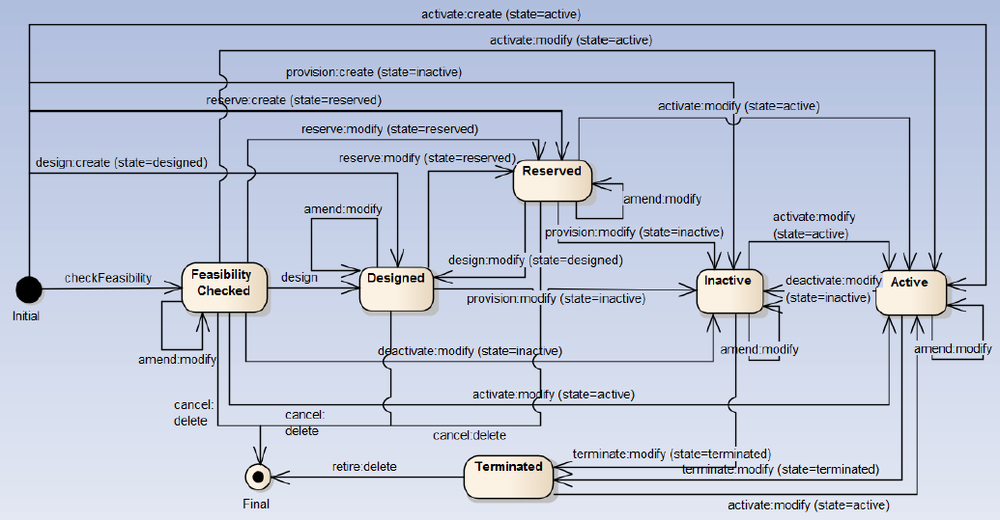](../images/service_states.png)
  

## NFVODeploymentRequest process

 
[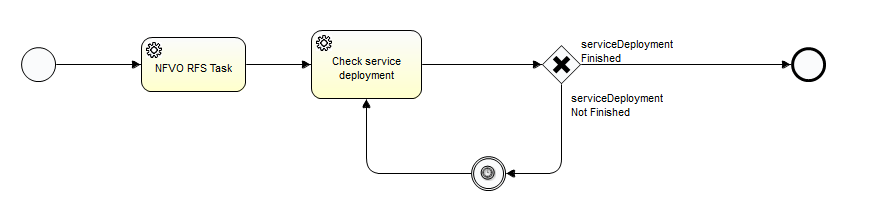](../images/NFVODeploymentReq_process.png)

This process is related with the NFVO orchestration
It will send a msg to NFVO(s?) for a specific deployment request
Then it checks the deployment status. It will wait 30 secs each time until the deployment is running (or failed)

## Check In Progress orders process

Every 1 minute the "Check In Progress Orders" process is executed checking if a supported Service changed state (i.e. to ACTIVE) then the whole Order will change state (e.g. go to COMPLETED)

[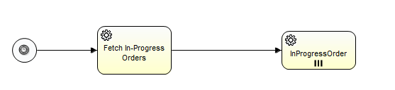](../images/check_inProgress_orders.png)
  
  
## External Service Provider Deployment Request process
  
[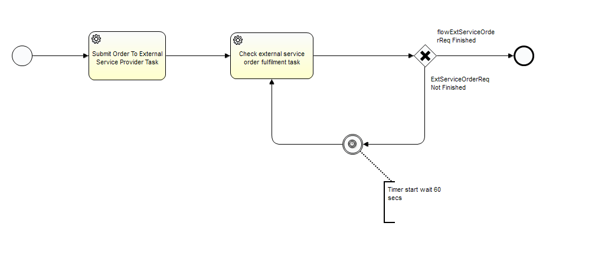](../images/externalSPDeploymentReq.png)

This process contains tasks for submitting order requests to external partners.
- Submit Order To External Service Provider Task: This task creates automatically a Service Order request to a 3rd party provider SO that hosts the Service Specification
- Check external service order fulfillment task: This task Check external partner for Service creations and updates our local inventory of services the service characteristics of remote Service Inventory

## Fetch Partner Services Process

[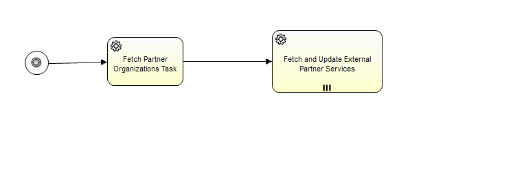](../images/fetchPartnerServices.png)

Every 2 minutes the "fetchPartnerServicesProcess" process is executed checking remote Partner Organizations for changes in the published catalogues.
The Fetch and Update External Partner Services Task is executed in paralle l for each Partner Organization 

## Local Service Orchestration Process

[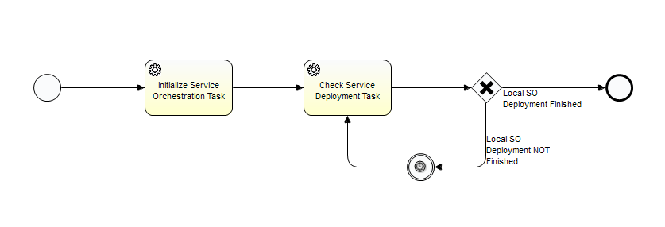](../images/LocalServiceOrchestrationProcess.png)

This process handles automatically services that need to be further orchestrated or processed by OSOM. For example, for a CFS Bundled service we create such automated service instances that just aggregate the underlying services. 

 
  